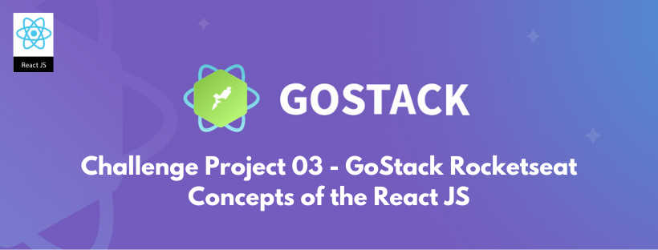

<h2 align="center"> 
  GoStack Rocketseat - Challenge 03 - Concepts of the React JS
</h2>

<p align="center">
  
</p>

<blockquote align="center">“Always evolving and learning more every day!”</blockquote>

<p align="center">

</p>

Below is the link to the Skylab course platform, where this project is part of the GoStack Rocketseat.
https://skylab.rocketseat.com.br/

### Application developed with React JS:

### To install the application:

This is a [React.js](https://reactjs.org/) project challenge. For install this project after clone, use next steps:

```bash
$ yarn
```
### To run the application:

After complete instalation, run the aplication with command:

```bash
$ yarn start
```
View this aplication at: http://localhost:3000

### A partial view of the application code in Visual Studio Code::

<p align="center">
  
</p>

### Learn more about me. Hire!

  https://www.linkedin.com/in/alexgomesnet/

### License:

  [MIT](LICENSE)
